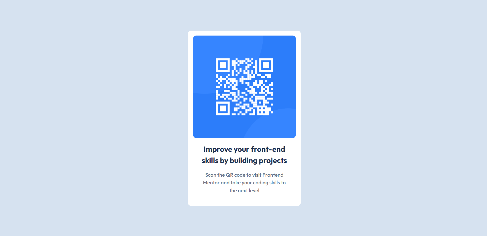

# Frontend Mentor - QR code component solution

This is a solution to the [QR code component challenge on Frontend Mentor](https://www.frontendmentor.io/challenges/qr-code-component-iux_sIO_H). Frontend Mentor challenges help you improve your coding skills by building realistic projects.

## Table of contents

- [Screenshot](#screenshot)
- [Links](#links)
- [Built with](#built-with)
- [Continued development](#continued-development)
- [Author](#author)

### Screenshot

### Links

- Solution URL: [Solution](https://www.frontendmentor.io/solutions/qr-code-component-YkQ2ZlwLAi)
- Live Site URL: [Live Site](https://abdelrhmankh.github.io/qr-code-component-main/)

### Built with

- Semantic HTML5 markup
- CSS custom properties
- Flexbox
- CSS Grid
- Mobile-first workflow

### Continued development

The Best understanding of the Style and how to improve the Css code with better understanding.

## Author

- Website - [AbdelRahman Khalil](https://abdelrhmankh.github.io/abdelrhmankhalil/)
- Frontend Mentor - [@abdelrhmanKh](https://www.frontendmentor.io/profile/abdelrhmanKh)
- LinkedIn - [@Abdelrhman-khalil](https://www.linkedin.com/in/abdelrhman-khalil-ali-9716a0188/)
- Upwork - [Abdelrhman khalil](https://www.upwork.com/freelancers/~0166fb261d37d97378)
